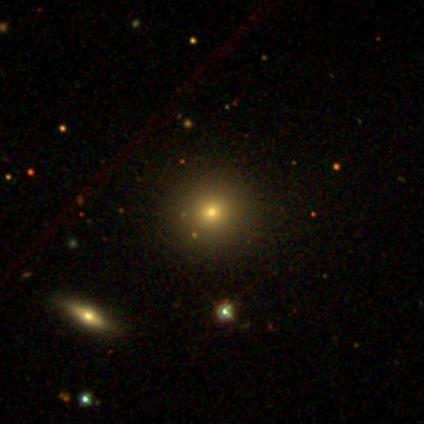
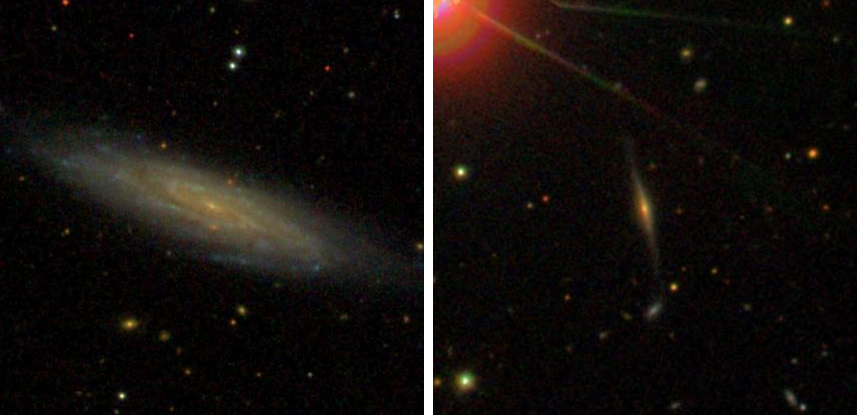
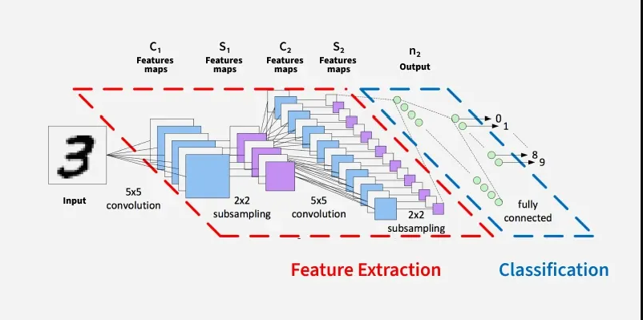
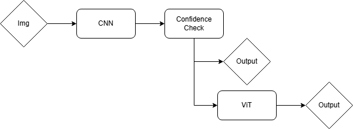

### How a hybrid model achieves high accuracy while reducing computation

---

## Introduction

Back in 2021, the James Webb Space Telescope (JWST) was launched into space. It is a marvel of modern engineering, capable of capturing images of objects too old or too faint to be observed by its predecessor, the Hubble Space Telescope.  

A fundamental task in astronomy is the classification of galaxies based on their morphology. Broadly speaking, galaxies can be divided into three categories: spiral, elliptical, and irregular. Scientists use these classifications to study the evolution of the universe and understand how galaxies change over time.

However, there is a major challenge. Modern telescopes like JWST generate *massive* amounts of image data, capturing galaxies in unprecedented detail. Manually labeling every image is simply not feasible. This makes the problem an ideal candidate for machine learning, particularly models that excel at image recognition and classification.

---

## The Challenge

At first glance, galaxy classification seems straightforward. Some galaxies have clear spiral arms, while others are smooth and elliptical. However, in practice, many images are ambiguous.

Noise, resolution limits, and unusual structures can make classification difficult—even for experts.

This leads to an important question:  
**Do all images require the same level of analysis?**

Consider the two images below:

One image is easy to classify, while the other is much more ambiguous. Treating every image the same way may be inefficient and unnecessarily slow down analysis.

---

## Existing Methods

There are two major types of deep learning models commonly used for image classification.

### Convolutional Neural Networks (CNNs)

CNNs, such as ResNet-50, are highly effective at detecting local patterns. They are relatively fast and efficient, making them a strong baseline for many tasks.

At a high level, a CNN works by taking a preprocessed image and applying filters to extract features like edges, textures, and shapes. These features are progressively simplified, retaining only the most important information. Finally, the processed features are passed through classification layers to produce a label.

*<https://www.geeksforgeeks.org/deep-learning/convolutional-neural-network-cnn-in-machine-learning/>*

A 2024 paper by Raul Urecheatu and Marc Frincu demonstrated a CNN architecture achieving 96.83% accuracy, outperforming standard models such as ResNet-50.

---

### Vision Transformers (ViT)

Vision Transformers process images differently. Instead of focusing on local patterns, they analyze relationships across the entire image.

You can think of a ViT like assembling a jigsaw puzzle. The image is divided into fixed-size patches, which are then flattened into sequences of numbers. Since transformers were originally designed for text, positional information is added so the model understands where each patch belongs.

Unlike CNNs, where only nearby pixels interact, ViTs allow all parts of the image to “communicate” with each other. This enables the model to capture global structure, often improving accuracy.

A 2021 paper by Lin et al. showed that efficient ViT models can outperform traditional methods when identifying faint, distant galaxies.

Each approach has clear strengths and weaknesses.

---

## Hybrid Approach

Instead of choosing between CNNs and Vision Transformers, this project explores combining both into a single system.

The idea is simple. A CNN is used as a first pass to classify every image. If the CNN is confident in its prediction, that result is accepted. If the model is uncertain, the image is passed to a Vision Transformer for further analysis.

This creates a “gatekeeping” system, where the more computationally expensive model is only used when necessary.

The system dynamically allocates resources, focusing effort where it matters most.

---

## How It Works

The system operates in three steps.

First, the CNN processes the image and outputs a probability distribution over the three classes. The highest probability is treated as the model’s confidence. For example, if the model outputs:

- Spiral: 0.2  
- Elliptical: 0.7  
- Other: 0.1  

then the model is considered 70% confident that the image is elliptical.

Next, this confidence is compared to a predefined threshold. If the confidence exceeds the threshold, the CNN’s prediction is used.

If the confidence falls below the threshold, the image is passed to the Vision Transformer, which produces the final prediction.

The threshold acts as a control mechanism. Lower thresholds favor speed by relying more on the CNN, while higher thresholds favor accuracy by invoking the ViT more often.

---

## Experimental Setup

To evaluate this approach, three models were used: ResNet-50, ViT-B/16, and the hybrid system.

The dataset used was Galaxy Zoo 2, one of the largest labeled galaxy datasets available. For simplicity, the classification task was reduced to three categories: spiral, elliptical, and other.

Rather than aggressively filtering the dataset, a more lenient approach was taken to preserve dataset size. All images were resized to 224×224 and normalized for training.

Both ResNet-50 and ViT-B/16 were trained using an 80/20 train-test split.

Each model was evaluated using:

- Accuracy  
- Macro F1 score  
- Time per image  

The hybrid model was tested across multiple thresholds to analyze the tradeoff between performance and computational cost.

---

## Results

### Model Comparison

| Model | Accuracy | Macro F1 | Time per Image |
|------|--------|---------|---------------|
| CNN (ResNet-50) | 72.44% | 0.717 | 1.688 ms |
| ViT | 75.41% | 0.746 | 6.266 ms |
| Hybrid | **75.42%** | **0.746** | 6.946 ms |

The CNN was the fastest model but had the lowest accuracy. The Vision Transformer achieved higher accuracy at a significantly higher computational cost.

The hybrid system matched the accuracy of the Vision Transformer while selectively applying it only when needed.

---

### Threshold Sensitivity

| Threshold | Accuracy | ViT Usage |
|----------|---------|----------|
| 0.60 | 74.36% | 25% |
| 0.80 | 75.38% | 63% |
| 0.95 | 75.42% | 86% |

As the threshold increases, more images are passed to the Vision Transformer. This improves accuracy but also increases computation time.

Thresholds below 0.3 were not tested, as it is not possible for the highest class probability to fall below this value with only three classes.

At very high thresholds, the computational overhead begins to outweigh the performance gains, reducing overall efficiency.

---

## Conclusion

This approach introduces several tradeoffs. The system requires training two separate models, and the confidence threshold must be manually selected. Additionally, there is computational overhead in managing the routing process, especially when many images are passed to the Vision Transformer.

Despite these limitations, the hybrid system demonstrates a compelling advantage. It combines the speed of CNNs with the accuracy of Vision Transformers, achieving high performance while maintaining control over computational cost.

Future work could explore learning the gating mechanism instead of relying on a fixed threshold. This would allow the system to dynamically decide when to use the Vision Transformer.

Another direction is applying this approach to other domains, such as medical imaging, where similar tradeoffs between speed and accuracy exist.

Overall, this project shows that combining models intelligently can be more effective than relying on a single approach. Rather than choosing between speed and performance, it is possible to achieve a balance between both.

---

## References

Lin, J. Y.-Y., Liao, S.-M., Huang, H.-J., Kuo, W.-T., & Ou, O. H.-M. (2021). Galaxy Morphological Classification with Efficient Vision Transformer. ArXiv.org. <https://arxiv.org/abs/2110.01024>

Ross E. Hart, Steven P. Bamford, Kyle W. Willett, Karen L. Masters, Carolin Cardamone, Chris J. Lintott, Robert J. Mackay, Robert C. Nichol, Christopher K. Rosslowe, Brooke D. Simmons, Rebecca J. Smethurst, Galaxy Zoo: comparing the demographics of spiral arm number and a new method for correcting redshift bias, Monthly Notices of the Royal Astronomical Society, Volume 461, Issue 4, 01 October 2016, Pages 3663–3682, <https://doi.org/10.1093/mnras/stw1588>

Urechiatu, R., & Frincu, M. (2024). Improved Galaxy Morphology Classification with Convolutional Neural Networks. Universe, 10(6), 230. <https://doi.org/10.3390/universe10060230>
